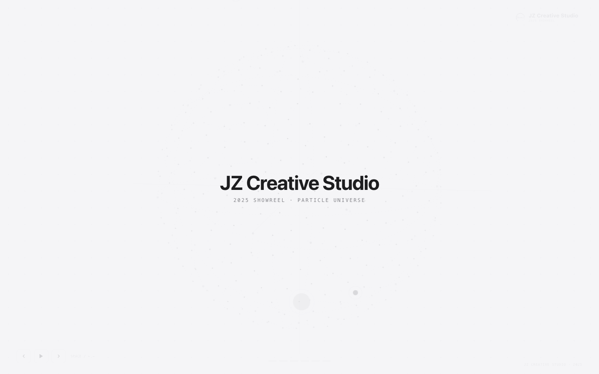
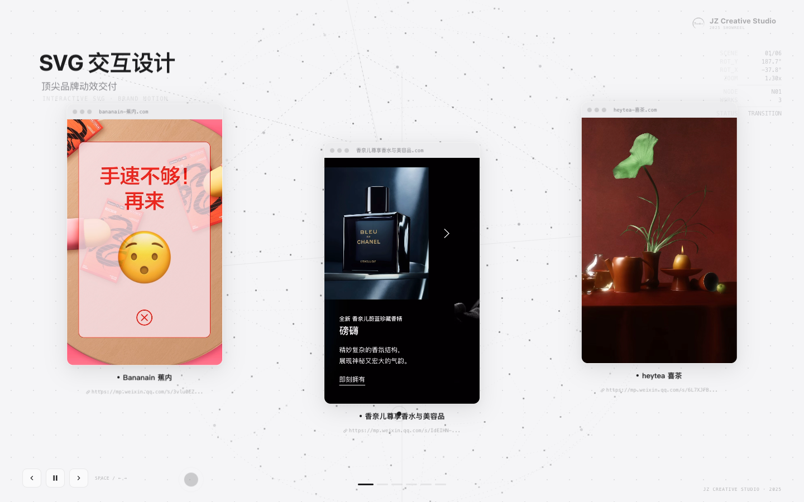

# 用 WorkBuddy 生成一个 GSAP 粒子球体作品集动画网站

## 场景描述

年底需要做一份工作室年度作品集 Showreel。传统的做法是用 After Effects 或 Premiere 手动剪辑，但这类工具对动效交互和 3D 视觉的迭代成本很高——每次调整缓动曲线或粒子参数都要重新渲染。

我希望换一种方式：用 GSAP + 软件 3D 投影做一个纯前端动画，300 个粒子聚拢成球体，6 个节点代表 6 组作品，点击节点后镜头聚焦、标题浮出、作品视频展开。整个过程在浏览器里实时运行，可以随时调整参数立即看到效果。

但手写这个动画的 3D 数学、粒子分布、时间线编排和 Mockup 布局非常耗时。所以我把它交给 WorkBuddy，用自然语言描述需求，让它逐步生成并迭代。

## 想要完成的任务

- **输入**：一份 6 场景脚本（含标题、副标题、作品名、链接），27 个本地媒体文件（MP4/MOV 视频 + 截图）
- **目标**：一个自包含 HTML 文件 + 本地媒体，在浏览器中实时播放粒子球体 Showreel 动画
- **交付物**：
  - 可在浏览器中预览的 HTML 动画
  - 推送到 GitHub 仓库并通过 GitHub Pages 在线访问

## 前置条件

- WorkBuddy 版本：支持本地文件读写和 Bash 执行的版本
- 操作系统：macOS（Windows/Linux 同样适用，路径稍作调整）
- 所需账号或权限：GitHub 账号，已配置 SSH key 或 personal access token
- 所需输入文件：27 个媒体文件放在本地文件夹，一份脚本文本

## 使用的 Skill

本次任务没有安装额外的 Skill，全程使用 WorkBuddy 的内置能力：

| 能力 | 用途 | 来源或安装方式 |
| --- | --- | --- |
| 本地文件读写 | 读取素材文件、写入生成的 HTML | WorkBuddy 内置 |
| Bash 执行 | 启动 HTTP 服务器、检查视频尺寸、Git 操作 | WorkBuddy 内置 |
| 网页预览 | 在浏览器中实时预览动画效果 | WorkBuddy 内置 |
| GSAP CDN 引用 | 通过 `<script>` 标签引入 GSAP 3.12.5 | 外部 CDN（cdnjs） |

## 在 WorkBuddy 中的操作

### 第一步：描述需求并提供素材路径

我把脚本和素材路径发给 WorkBuddy：

```text
我准备设计一个工作室作品集动画视频，标题是「JZ Creative Studio 2025 Showreel」。
要求：浅色背景 + 点线 MG 设计，开场形成一个基于 GSAP 的大型粒子球体，
球面上有节点代表作品组，聚焦节点后弹出作品视频。

脚本：
场景1 - SVG 交互设计（蕉内 / 香奈儿 / 喜茶）
场景2 - H5 互动页面（中国新闻网 / 互动叙事H5）
场景3 - Vibe Coding（在线技能五子棋）
场景4 - AIGC 创意设计（数据可视化 / 航天科普 / 政务漫画）
场景5 - AI 创新方法论（编程式快闪 / 音乐Remix / SVG融合）
场景6 - 复旦百廿·母校礼赞（复旦120周年专题）

素材都在本地文件夹：/Users/yaoyao/Documents/Marshall工作文档/运营/Showreel/2025
```

WorkBuddy 读取了素材目录，生成了第一版 HTML，并启动了本地 HTTP 服务器让我预览。

### 第二步：迭代调整视觉与动画

第一版出来后，我开始逐轮反馈。以下是关键的迭代节点：

**第 2-3 轮**：颜色太多 → 改为 Apple 黑白灰（`#1D1D1F` / `#86868B` / `#F5F5F7`）；只有开场没有转场 → 补全 6 个场景的完整流程。

**第 4-5 轮**：节点用 CSS 3D Transform 会随球体翻转被压扁 → 放弃 CSS 3D，改为纯 JS 软件 3D 投影（手动旋转矩阵 + 透视投影），节点用 2D `translate()` 定位，只同步位置不翻转。

**第 6-7 轮**：节点视觉上在球体之外 → 使用 Fibonacci 球面粒子索引直接替换对应位置的粒子，确保节点在球面上；增加坐标轴、大圆参考线、倾斜轨道、粒子间虚线连接等装饰。

**第 8-9 轮**：Mockup 风格不统一 → 统一为浏览器窗口线框风格（标题栏 + 圆点 + URL + 内容区）；通过 `sips` 命令检查所有截图实际像素尺寸，修正竖版/横版比例。

**第 10-11 轮**：作品展示面积太小 → 放大 Mockup 尺寸并增加漂浮动画；标题从节点位置浮出，带连接线和持续漂浮。

**第 12 轮**：页面空白打不开 → JS 语法错误（`},0})` 漏了一个 `}`），修复后正常。

**第 13-14 轮**：动画太快 → 全局减速 1.5-2 倍，缓动改用 `power4.inOut` / `back.out(1.2)`；五子棋视频被裁切 → Mockup 内容区比例精确匹配视频比例（780×528 对应 1.560）。

**第 15-16 轮**：节点进入球体内部 → 投影坐标乘以 0.82 使节点视觉上嵌入球面；结尾 LOGO 替换为水墨头像 PNG；字体改为阿里巴巴普惠体 2.0。

**第 17 轮**：放大动画不显示 → 发现 GSAP timeline 中退出和新场景的 `camS` tween 各自创建独立临时对象，导致起始值=终值无渐变 → 改为共享同一对象修复。

### 第三步：推送到 GitHub 并启用 Pages

```text
把这个项目和关联资产都推到我的 GitHub 仓库：
https://github.com/JZCreative/2025showreel
```

WorkBuddy 自动完成了：
1. 创建 `.gitignore`（排除 node_modules、构建产物）
2. `git init` + `git add` + `git commit`
3. `git push`（414MB 媒体文件，约 4 分钟上传完成）
4. 通过 GitHub API 启用 Pages
5. 创建 `index.html` 重定向页面

### 提示词或任务指令

以下是经过脱敏、可以复用的核心任务指令：

```text
设计一个工作室作品集动画，要求：
- 浅色背景 + 点线 MG 设计风格
- 开场：GSAP 驱动的 3D 粒子球体（300 个粒子，Fibonacci 分布）
- 球面上 6 个节点代表 6 组作品
- 聚焦节点：球体旋转 → 镜头缩放 → 节点放大 → 标题浮出 → Mockup 展开
- 颜色：Apple 黑白灰（#1D1D1F / #86868B / #F5F5F7）
- 字体：阿里巴巴普惠体 2.0
- 键盘控制：Space 播放暂停 / ← → 切换场景 / Esc 跳结尾
- 结尾：粒子消散，水墨头像淡入

素材路径：[本地文件夹路径]
```

迭代阶段的典型反馈指令：

```text
节点看起来还是在粒子球之外，让它们进入球体内部；
五子棋视频被裁切了，调整 Mockup 比例匹配视频；
动画整体太快，慢一些更丝滑；
结尾 LOGO 替换为这个 PNG。
```

## 在 WorkBuddy 中的效果

最终交付物：

- **主文件**：`showreel-preview.html`（约 33KB，自包含 HTML + CSS + JS）
- **媒体资产**：`public/works/` 下 27 个文件（13 视频 + 14 截图）
- **在线预览**：https://jzcreative.github.io/2025showreel/
- **GitHub 仓库**：https://github.com/JZCreative/2025showreel

动画效果概述：



*300 个粒子聚拢成球体，带坐标轴、大圆参考线和粒子间虚线连接。*



*聚焦节点后，标题从节点浮出，Mockup 浏览器窗口沿分支线展开，右上角信息面板实时显示旋转数据。*

- 300 个粒子从随机散开位置聚拢成球体（3 秒，`power4.out`）
- 球体缓慢自转，带坐标轴、大圆参考线、粒子间虚线连接
- 点击节点或按 `→` 切换场景：球体旋转将目标节点转到正面（1.8 秒，`power4.inOut`）
- 镜头缩放至 1.3x，节点放大 1.8x（`back.out(1.2)` 回弹）
- 标题从节点位置浮出到左上角，带贝塞尔曲线连接线
- Mockup 浏览器窗口沿分支线展开，持续 sine.inOut 漂浮
- 右上角信息面板实时显示旋转角度、缩放倍率、当前节点

## 验收标准

- [x] 浏览器中打开能正常播放 6 个场景的完整动画
- [x] 粒子球体旋转流畅，节点在球面内部
- [x] 每个场景的视频比例正确，无裁切
- [x] 键盘控制（Space / ← → / Esc）正常响应
- [x] 播放到结尾后不自动循环
- [x] 字体为阿里巴巴普惠体 2.0
- [x] 结尾显示水墨头像
- [x] GitHub Pages 在线可访问
- [x] README 包含项目说明和使用方式

## 遇到的问题

### CSS 3D Transform 导致节点压扁

**问题**：节点作为 3D-transformed div 在球体旋转时被透视压扁变形。

**解决**：完全放弃 CSS 3D Transform，改为纯 JS 软件 3D 投影。手动计算旋转矩阵（Y 轴旋转 → X 轴旋转 → 透视投影），节点用 2D `translate(x, y)` 定位，只同步位置不参与 3D 翻转。

### 性能卡顿（69000 次 DOM 更新/帧）

**问题**：260 个粒子各自绑定 `onUpdate: apply()` 回调，每帧触发 260 次完整 DOM 更新。

**解决**：改用 `gsap.ticker.add(formTick)` 单帧回调，每帧只调用一次 `apply()` 统一更新所有粒子和装饰元素。

### 放大动画瞬间跳变

**问题**：退出旧场景和新场景的 `camS` tween 各自创建临时对象 `{s: camS}`，timeline 创建时 `camS=1.3`，新场景 tween 从 1.3→1.3 无渐变。

**解决**：在 `goScene()` 开头创建共享对象 `const camObj = {s: camS}`，退出和新场景的 tween 都操作同一对象，退出 tween 先把值归 1，新场景 tween 再从 1 渐变到 1.3。

### GitHub 大文件警告

**问题**：`s2w1.mov`（67MB）超过 GitHub 建议的 50MB 上限。

**解决**：文件仍在 100MB 硬限制内，推送成功。GitHub 发出警告但未阻止。如果后续需要更大文件，可考虑 Git LFS。

## 安全与限制

- **本地文件访问**：WorkBuddy 需要读取本地素材文件夹，确保路径正确且文件无敏感信息。
- **GitHub 推送**：推送前确认 `.gitignore` 排除了 `node_modules`、构建产物和 `.workbuddy` 工作区数据。
- **GitHub API**：启用 Pages 需要 personal access token，不要将 token 提交到仓库。
- **媒体版权**：确保推送的视频和截图拥有发布权限，本项目中的作品均为自有内容。
- **在线预览**：GitHub Pages 为公开访问，确认内容可以公开展示。

## 可以怎样复用

这个案例的方法可以迁移到多种场景：

- **替换内容**：把脚本和素材换成自己的作品集，即可生成个人 Showreel。
- **调整视觉**：修改 `--fd` / `--fb` / `--fm` CSS 变量切换字体，修改 `--bg` / `--ink` / `--soft` 切换配色。
- **增减场景**：在 `SCENES` 数组中增删条目，调整 `NIDX` 节点索引即可。
- **换 3D 效果**：修改 `project()` 函数的投影参数或 `genSphere()` 的分布算法，可以产生不同的球体形态。
- **迁移到其他框架**：核心的 3D 投影逻辑是纯 JS，可以移植到 React/Vue 组件中。

关键经验：

1. **先描述效果，再描述实现**：告诉 WorkBuddy 你想要什么视觉效果，而不是直接指定技术方案。它会在尝试中找到最优解（比如从 CSS 3D 到软件投影的转变）。
2. **一轮一个反馈点**：每次只反馈一个最突出的问题，避免同时改太多导致难以定位。
3. **用 `sips` / `ffprobe` 验证事实**：涉及像素尺寸、视频比例等客观参数时，用命令行工具获取实际值，而不是凭目测。
4. **共享对象避免 tween 状态丢失**：GSAP timeline 中多个 tween 操作同一变量时，必须使用共享对象而非各自创建临时对象。
